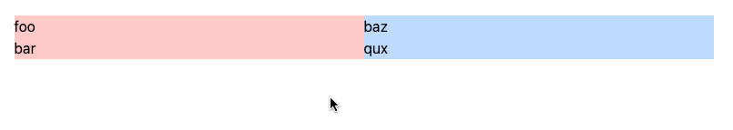

## Laravel Dragula

[](https://packagist.org/packages/authanram/laravel-dragula)
[](https://github.com/authanram/laravel-dragula/actions?query=workflow%3Arun-tests+branch%3Amain)
[](https://github.com/authanram/laravel-dragula/actions?query=workflow%3A"Fix+PHP+code+style+issues"+branch%3Amain)
[](https://packagist.org/packages/authanram/laravel-dragula)

Integrates [Dragula](https://bevacqua.github.io/dragula/) as blade component.

## Demo

Here you can see the result of the code used at the section [Usage](#usage).



## Installation

You can install the package via composer:

```bash
composer require authanram/laravel-dragula
```

Publish the assets:

```bash
php artisan vendor:publish --tag=dragula-assets --force
```

Include the assets:

```html
<html>
<head>
    <x-laravel-dragula::dragula-styles/>
    <x-laravel-dragula::dragula-scripts/>
</head>
...
</html>
```

## Usage

This code will lead to the result shown at the section [demo](#demo).

```html
<x-laravel-dragula::dragula-container class="flex w-full">
    <x-laravel-dragula::dragula
        class="bg-red-200 w-1/2"
        id="left"
    >
        <div>foo</div>
        <div>bar</div>
    </x-laravel-dragula::dragula>
    
    <x-laravel-dragula::dragula
        class="bg-blue-200 w-1/2"
        id="right"
    >
        <div>baz</div>
        <div>qux</div>
    </x-laravel-dragula::dragula>
</x-laravel-dragula::dragula-container>
```

If you need to access the dragula api, you can do so:

```html
<x-laravel-dragula::dragula-container>
    <x-laravel-dragula::dragula id="left">
        ...
    </x-laravel-dragula::dragula>
    
    <x-laravel-dragula::dragula id="right">
        ...
    </x-laravel-dragula::dragula>
    
    <x-slot:script>
        <script>
            dragula()
                .on('drag', (el) => console.log('drag', el.id))
                .on('drop', (el) => console.log('drop', el.id))
                .on('over', (el, container) => console.log('over', el.id, container))
                .on('out', (el, container) => console.log('out', el.id, container));
        </script>
    </x-slot:script>
</x-laravel-dragula::dragula-container>
```

The corresponding query selectors will be passed automatically to the function call `dragula()`.

Refer to [resources/views/components/dragula-scripts.blade.php](https://github.com/authanram/laravel-dragula/blob/master/resources/views/components/dragula-scripts.blade.php) for details.

## Testing

```bash
composer test
```

## Changelog

Please see [CHANGELOG](CHANGELOG.md) for more information on what has changed recently.

## Contributing

Please see [CONTRIBUTING](.github/CONTRIBUTING.md) for details.

## Security Vulnerabilities

Please review [our security policy](security/policy) on how to report security vulnerabilities.

## Credits

- [Daniel Seuffer](https://github.com/authanram)
- [All Contributors](../../contributors)

## License

The MIT License (MIT). Please see [License File](LICENSE.md) for more information.
